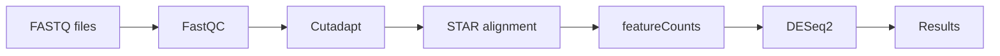

# RNA-seq Differential Gene Expression Workflow (Snakemake)

This repository contains a reproducible RNA-seq analysis workflow implemented using **Snakemake**. The pipeline performs quality control, read trimming, genome alignment, gene quantification, and differential expression analysis between two experimental conditions.

This workflow was redesigned from the **Biomedical Data Analysis** Master’s module of Life Science Informatics. By integrating isolated Conda environments, the analysis follows current bioinformatics best practices, ensuring the pipeline remains scalable and reproducible across different computing platforms.

---

## Workflow Overview

The pipeline performs the following steps:

1. **Quality control**
   - Tool: FastQC
   - Input: raw FASTQ files
   - Output: HTML quality reports

2. **Adapter trimming and quality filtering**
   - Tool: Cutadapt
   - Removes low-quality bases and short reads

3. **Genome indexing**
   - Tool: STAR
   - Generates genome index from reference FASTA and GTF files

4. **Read alignment**
   - Tool: STAR
   - Maps reads to the reference genome

5. **Gene-level quantification**
   - Tool: featureCounts (Subread)
   - Produces gene count matrix

6. **Differential expression analysis**
   - Tool: DESeq2 (R)
   - Identifies significantly up-regulated and down-regulated genes

---

## Workflow Diagram


---

## Repository Structure
```text
.
├── Snakefile              # Pipeline logic
├── deseq_rScript.r        # Differential expression analysis
├── README.md
├── .gitignore
├── envs/                  # Conda environment definitions
│   ├── fastqc.yaml
│   ├── cutadapt.yaml
|   ├── star.yaml
|   ├── subread.yaml
│   └── deseq2.yaml
├── featureCounts_output.txt
├── deseq2_results.txt
├── deseq2_up.txt
└── deseq2_down.txt
```
---
## Requirements

Install one of the following:
- Conda (Miniconda or Anaconda)
- Snakemake

Recommended installation:
```bash
conda install -c bioconda -c conda-forge snakemake
```

---
## Running the Workflow

Place your RNA-seq FASTQ files in the project directory using the naming format:

sample_0.fastq.gz \
sample_1.fastq.gz \
... \
sample_5.fastq.gz

**Also provide reference files:** \
genome.fa \
annotation.gtf

**Run the workflow:** 
```bash
snakemake --use-conda --cores 4
```

Snakemake will automatically:

- create environments
- run each analysis step
- generate output files

---

## Output Files

Main outputs include:

| File | Description |
|-----|-------------|
| featureCounts_output.txt | Gene count matrix |
| deseq2_results.txt | Full differential expression results |
| deseq2_up.txt | Up-regulated genes (log2FC ≥ 2) |
| deseq2_down.txt | Down-regulated genes (log2FC ≤ −2) |
| fastqc_reports/ | Quality control reports |

---

## Reproducibility

Each step runs in an isolated Conda environment defined in: \
```bash
 envs/*.yaml 
 ```

This ensures consistent and reproducible results across systems.

---

## Tools Used

- Snakemake
- FastQC
- Cutadapt
- STAR aligner
- Subread (featureCounts)
- DESeq2 (R)

---

## Author

Bioinformatics workflow developed as part of RNA-seq data analysis training and portfolio project.
